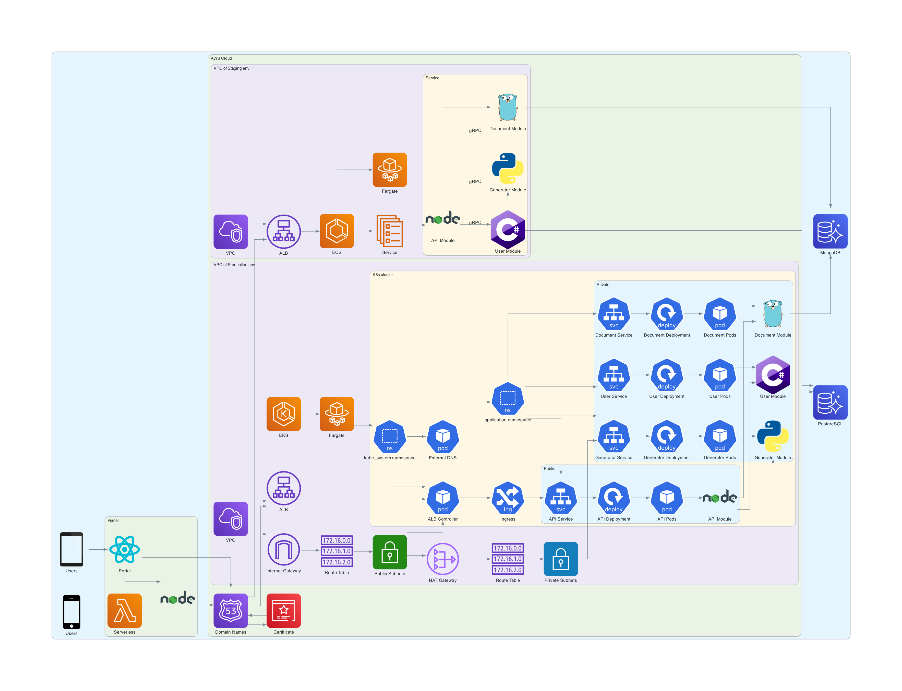

# Sketch Blend

A drawing and sharing portal that is powered by micro-service architecture in Kubernetes with AWS, and multiple backend lanaguages linked with Grpc

### Architecture Overview

### Backend Services

- [API Docs](https://sketch-blend-api-dev.isaacdev.net/docs)

  

- [API Module Repo](https://github.com/IsaacOrzDev/sketch-blend-api)

  
  

- [User Module Repo](https://github.com/IsaacOrzDev/sketch-blend-user-module)

  
  
  

- [Generator Module Repo](https://github.com/IsaacOrzDev/sketch-blend-generator-module)

  

- [Document Module Repo](https://github.com/IsaacOrzDev/sketch-blend-document-module)

  
  

### Infrastructure as Code

- [EKS / ECS Terraform Repo](https://github.com/IsaacOrzDev/sketch-blend-terraform)

  
  
  
  

- [SNS / SES Email Pulumi Repo](https://github.com/IsaacOrzDev/email-service-pulumi-stack)

  
  

### Frontend Portal

- [Portal-Repo](https://github.com/IsaacOrzDev/sketch-blend-portal)

  
  
  
